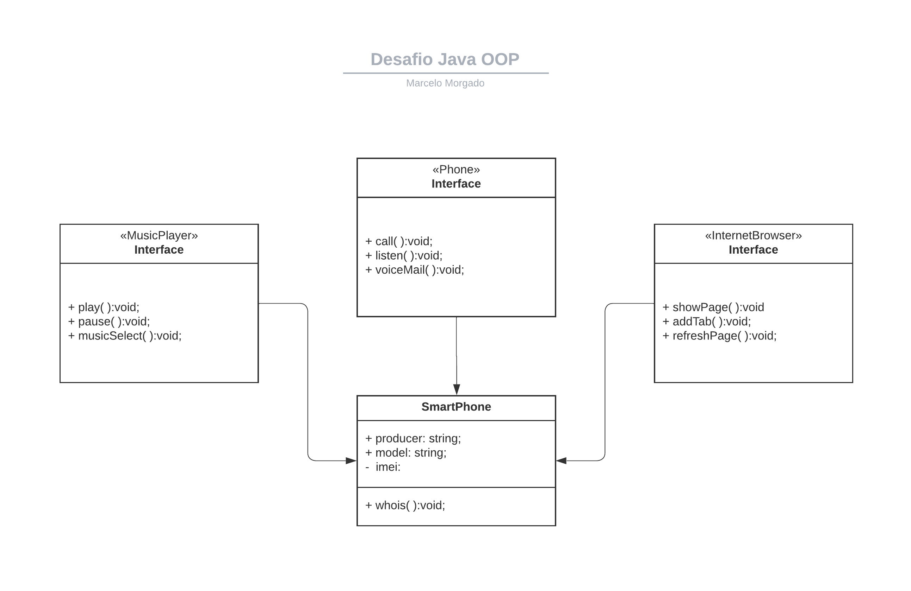

<h1 align="center"> - Java challenge diagramming class - </h1>

- ### Objetivo:
#### *Elaborar uma ferramenta de UML de sua preferência. A diagramação das classes e interfaces com a proposta de representar os papéis do iPhone de: Reprodutor Musical, Aparelho Telefônico e Navegador na Internet. Em seguida crie as classes e interfaces no formato de arquivos .java*.

 

- ### Objective:
#### *Create a UML tool of your choice. The layout of classes and interfaces with the aim of representing the iPhone's roles as: Music Player, Telephone Device and Internet Browser. Then create the classes and interfaces in .java file format*

 
 

- ### Solution:

<h4 align="center"><a href="https://github.com/marcelomorg"> by Marcelo Morgado developer </a></h4>